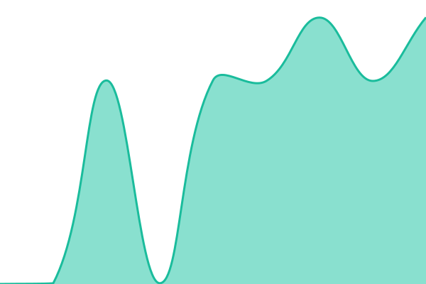
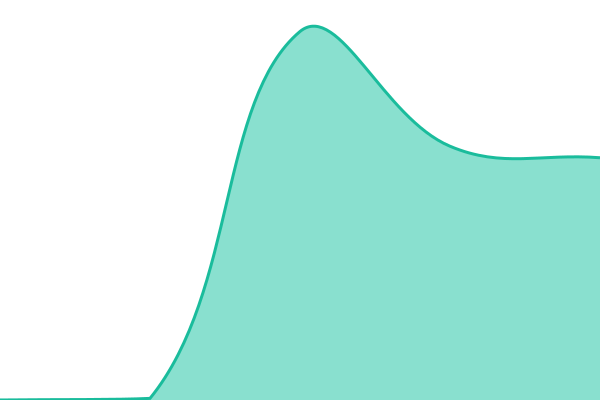

# 📈 Website Live Status

| URL | Status | History | Response Time | Uptime |
| --- | ------ | ------- | ------------- | ------ |
|  [Portfolio](https://ujjwalkumar14b.github.io/me/) | 🟩 Up | [portfolio.yml](https://github.com/ujjwalkumar14b/Website_Status/commits/HEAD/history/portfolio.yml) | 

 156ms
     
 | 

<a href="https://demo.upptime.js.org/history/portfolio">100.00%</a>
    

|  [Product Recommendation System](https://recommend-m0mw.onrender.com/) | 🟩 Up | [product-recommendation-system.yml](https://github.com/ujjwalkumar14b/Website_Status/commits/HEAD/history/product-recommendation-system.yml) | 

 8266ms
     
 | 

<a href="https://demo.upptime.js.org/history/product-recommendation-system">100.00%</a>
    

|  [Ride Fare Dynamic Pricing Model](https://dynamic-pricing-h35o.onrender.com/) | 🟩 Up | [ride-fare-dynamic-pricing-model.yml](https://github.com/ujjwalkumar14b/Website_Status/commits/HEAD/history/ride-fare-dynamic-pricing-model.yml) | 

 10833ms
     
 | 

<a href="https://demo.upptime.js.org/history/ride-fare-dynamic-pricing-model">100.00%</a>
    

|  [Credit Card Fraud Detection](https://credit-card-fraud-detection-v4m8.onrender.com/) | 🟩 Up | [credit-card-fraud-detection.yml](https://github.com/ujjwalkumar14b/Website_Status/commits/HEAD/history/credit-card-fraud-detection.yml) | 

 10898ms
     
 | 

<a href="https://demo.upptime.js.org/history/credit-card-fraud-detection">100.00%</a>
    

|  [Text Summarizer](https://text-summarizer-jkym.onrender.com/) | 🟩 Up | [text-summarizer.yml](https://github.com/ujjwalkumar14b/Website_Status/commits/HEAD/history/text-summarizer.yml) | 

 142ms
     
 | 

<a href="https://demo.upptime.js.org/history/text-summarizer">100.00%</a>
    

|  [Social Media Website](https://social-media-frontend-sigma-two.vercel.app/) | 🟩 Up | [social-media-website.yml](https://github.com/ujjwalkumar14b/Website_Status/commits/HEAD/history/social-media-website.yml) | 

 196ms
     
 | 

<a href="https://demo.upptime.js.org/history/social-media-website">100.00%</a>
    

