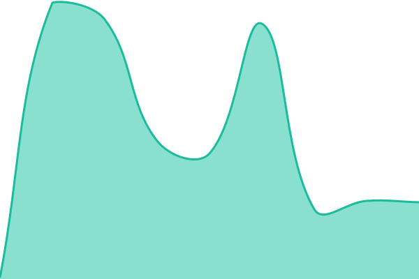

# [📈 Live Status](https://demo.upptime.js.org): <!--live status--> **🟩 All systems operational**

This repository contains the open-source uptime monitor and status page for [Ujjwal Kumar](https://ujjwalkumar14b.github.io/me/), powered by [Upptime](https://github.com/upptime/upptime).

With [Upptime](https://upptime.js.org), you can get your own unlimited and free uptime monitor and status page, powered entirely by a GitHub repository. We use [Issues](https://github.com/ujjwalkumar14b/Website_Status/issues) as incident reports, [Actions](https://github.com/ujjwalkumar14b/Website_Status/actions) as uptime monitors, and [Pages](https://demo.upptime.js.org) for the status page.

<!--start: status pages-->
<!-- This summary is generated by Upptime (https://github.com/upptime/upptime) -->
<!-- Do not edit this manually, your changes will be overwritten -->
<!-- prettier-ignore -->
| URL | Status | History | Response Time | Uptime |
| --- | ------ | ------- | ------------- | ------ |
|  [Product Recommendation System](https://recommend-m0mw.onrender.com/) | 🟩 Up | [product-recommendation-system.yml](https://github.com/ujjwalkumar14b/Website_Status/commits/HEAD/history/product-recommendation-system.yml) | 

 31265ms
     
 | 

<a href="https://demo.upptime.js.org/history/product-recommendation-system">100.00%</a>
    

|  [Dynamic Pricing](https://dynamic-pricing-h35o.onrender.com/) | 🟩 Up | [dynamic-pricing.yml](https://github.com/ujjwalkumar14b/Website_Status/commits/HEAD/history/dynamic-pricing.yml) | 

 32210ms
     
 | 

<a href="https://demo.upptime.js.org/history/dynamic-pricing">100.00%</a>
    

|  [Credit Card Fraud Detection](https://credit-card-fraud-detection-v4m8.onrender.com/) | 🟩 Up | [credit-card-fraud-detection.yml](https://github.com/ujjwalkumar14b/Website_Status/commits/HEAD/history/credit-card-fraud-detection.yml) | 

 1077ms
     
 | 

<a href="https://demo.upptime.js.org/history/credit-card-fraud-detection">100.00%</a>
    

|  [Social Media Website](https://social-media-frontend-sigma-two.vercel.app/) | 🟩 Up | [social-media-website.yml](https://github.com/ujjwalkumar14b/Website_Status/commits/HEAD/history/social-media-website.yml) | 

 203ms
     
 | 

<a href="https://demo.upptime.js.org/history/social-media-website">100.00%</a>
    

<!--end: status pages-->

[**Visit our status website →**](https://demo.upptime.js.org)

## 📄 License

- Powered by: [Upptime](https://github.com/upptime/upptime)
- Code: [MIT](./LICENSE) © [Anand Chowdhary](https://anandchowdhary.com)
- Data in the `./history` directory: [Open Database License](https://opendatacommons.org/licenses/odbl/1-0/)
